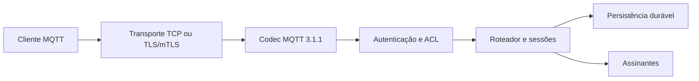

# XMQR

XMQR é um broker MQTT escrito em Rust, criado para evoluir em pequenas fatias
testáveis e interoperáveis. O foco atual é MQTT 3.1.1; recursos MQTT 5.0 serão
adicionados apenas quando puderem ser isolados e verificados sem enfraquecer o
núcleo 3.1.1.

**Nome do projeto:** XMQR. Durante a série `0.x`, o crate e os executáveis
continuam com os nomes compatíveis `mqtt-broker`, `mqtt-client` e `mqtt-admin`.

> **Estado do projeto:** experimental. XMQR ainda não declara conformidade MQTT
> 3.1.1 completa nem prontidão para produção. Last Will existe na 0.6 local; ainda
> faltam cobertura externa completa, testes de carga e recuperação operacional.

## Por que XMQR?

- implementação assíncrona em Rust com limites explícitos por conexão;
- separação entre codec, conexão, autenticação, roteamento e persistência;
- QoS 0, 1 e 2 com estado durável e confirmação após persistência;
- sessões persistentes, mensagens retidas e `UNSUBSCRIBE`;
- TLS/mTLS, usuário/senha e ACL deny-by-default no modo seguro;
- laboratórios locais progressivos para aprender MQTT antes de introduzir TLS;
- testes associados às cláusulas MQTT 3.1.1 quando aplicável.

## Versões

| Versão | Estado | Destaques |
| --- | --- | --- |
| `0.3.x` | manutenção | laboratório QoS 0 aberto, anônimo e restrito a loopback |
| `0.4.x` | estável experimental | laboratórios com senha e com ACL; CRUD administrativo de usuários |
| `0.5.x` | tag v0.5.0 verificada | filtros `+`/`#`, regra `$` e testes com Mosquitto |
| `0.6.x` | gates locais aprovados, aguardando publicacao | retained revisado e Last Will duravel |

Versões publicadas são identificadas por tags anotadas, por exemplo
`v0.4.0`. As branches `release/0.3` e `release/0.4` existem apenas para
correções compatíveis dessas séries. O desenvolvimento futuro ocorre em
`main`. Consulte [VERSIONING.md](VERSIONING.md) e [CHANGELOG.md](CHANGELOG.md).

Consulte [sequencia incremental](docs/incremental-versions.md) e [Last Will](docs/last-will.md).

## Arquitetura



O caminho assíncrono não executa I/O de disco diretamente. Alterações duráveis
são serializadas por um ator de persistência; ACKs que transferem
responsabilidade são enviados somente depois do nível de durabilidade
configurado.

## Funcionalidades MQTT 3.1.1

| Recurso | Situação |
| --- | --- |
| `CONNECT`/`CONNACK` | implementado para os perfis documentados |
| `PUBLISH` QoS 0/1/2 | implementado |
| `PUBACK`/`PUBREC`/`PUBREL`/`PUBCOMP` | implementado |
| `SUBSCRIBE`/`SUBACK` | implementado |
| `UNSUBSCRIBE`/`UNSUBACK` | implementado |
| Mensagens retidas | implementado |
| Sessões persistentes (`CleanSession=0`) | implementado |
| Filtros `+` e `#` | implementado na série 0.5 em desenvolvimento |
| Last Will | implementado em 0.6 local, com persistencia e ACL |
| MQTT 5.0 | fora do escopo atual |

A evidência disponível fica na
[matriz MQTT 3.1.1](docs/conformance/mqtt311-status.md). A tabela não representa
uma declaração de conformidade completa.

## Começo rápido: laboratório aberto

Requisitos:

- Rust estável `1.88` ou mais recente;
- componentes `rustfmt` e `clippy` (`rustup component add rustfmt clippy`);
- Linux ou WSL2 para o fluxo administrativo atômico;
- OpenSSL apenas para preparar certificados do modo seguro.

Compile os três binários:

```bash
git clone https://github.com/licodevone/xmqr.git
cd xmqr
export CARGO_TARGET_DIR="$HOME/.cache/xmqr-target"
cargo build --locked --release --bins
```

No primeiro terminal, inicie o broker local sem autenticação:

```bash
mkdir -p "$HOME/.local/share/xmqr-open-lab"
chmod 700 "$HOME/.local/share/xmqr-open-lab"

MQTT_MODE=open-lab \
MQTT_BIND=127.0.0.1:1883 \
MQTT_STATE_DIR="$HOME/.local/share/xmqr-open-lab" \
RUST_LOG=info \
"$CARGO_TARGET_DIR/release/mqtt-broker"
```

No segundo terminal, assine o tópico:

```bash
export CARGO_TARGET_DIR="$HOME/.cache/xmqr-target"
"$CARGO_TARGET_DIR/release/mqtt-client" sub \
  --open-lab \
  --topic 'aula/mensagem' \
  --host 127.0.0.1 \
  --port 1883 \
  --client-id 'exemplo-sub' \
  --qos 0
```

No terceiro terminal, publique manualmente:

```bash
export CARGO_TARGET_DIR="$HOME/.cache/xmqr-target"
"$CARGO_TARGET_DIR/release/mqtt-client" pub \
  --open-lab \
  --topic 'aula/mensagem' \
  --message 'Olá, XMQR!' \
  --host 127.0.0.1 \
  --port 1883 \
  --client-id 'exemplo-pub' \
  --qos 0
```

O roteiro completo, incluindo senha e ACL, está em
[docs/laboratorio-mqtt-aberto.md](docs/laboratorio-mqtt-aberto.md).

O broker deve registrar `OPEN LAB listener started...`; o assinante deve mostrar
`Assinatura ativa...` e, depois da publicação, imprimir `Olá, XMQR!`. Pressione
`Ctrl+C` no assinante e no broker para encerrar. Reutilize o diretório de estado
somente com o mesmo perfil; para começar limpo, mova o diretório antigo para um
backup enquanto o broker estiver parado.

## Perfis de segurança

| `MQTT_MODE` | Transporte | Identidade | Autorização | Uso |
| --- | --- | --- | --- | --- |
| `open-lab` | TCP simples | anônimo | qualquer tópico válido | primeira aula local |
| `password-lab` | TCP simples | usuário + senha | qualquer tópico válido | aula de autenticação |
| `acl-lab` | TCP simples | usuário + senha | ACL deny-by-default | aula de autorização |
| `secure-mtls` | TLS/mTLS | certificado + usuário + senha | ACL deny-by-default | modo endurecido padrão |

Os três modos de laboratório aceitam somente `127.0.0.1` ou `::1`. Senhas e
payloads trafegam sem criptografia em `password-lab` e `acl-lab`; nunca exponha
esses modos à LAN ou à internet.

## Administração de usuários

```bash
"$CARGO_TARGET_DIR/release/mqtt-admin" user create --users-file users.toml --username dispositivo-01
"$CARGO_TARGET_DIR/release/mqtt-admin" user list --users-file users.toml
"$CARGO_TARGET_DIR/release/mqtt-admin" user update-password --users-file users.toml --username dispositivo-01
"$CARGO_TARGET_DIR/release/mqtt-admin" user delete --users-file users.toml --username dispositivo-01
```

Senhas são solicitadas interativamente e armazenadas como hash Argon2id. O
arquivo real `users.toml` é ignorado pelo Git; publique somente arquivos
`.example` sem credenciais reais. Veja
[docs/administracao-usuarios.md](docs/administracao-usuarios.md).

## Configuração

| Variável | Obrigatória em | Finalidade |
| --- | --- | --- |
| `MQTT_MODE` | opcional | perfil; ausência seleciona `secure-mtls` |
| `MQTT_BIND` | opcional | endereço; laboratórios usam `127.0.0.1:1883` |
| `MQTT_STATE_DIR` | todos | WAL, snapshot e marcador do perfil |
| `MQTT_USERS_FILE` | senha, ACL e seguro | usuários e hashes Argon2id |
| `MQTT_ACL_FILE` | ACL e seguro | permissões de publicação e assinatura |
| `MQTT_SERVER_CERT` | seguro | cadeia do certificado do servidor |
| `MQTT_SERVER_KEY` | seguro | chave privada do servidor |
| `MQTT_CLIENT_CA` | seguro | CA usada para validar clientes |
| `MQTT_CLIENT_CRL` | seguro, opcional | lista de certificados revogados |

Cada perfil precisa de seu próprio `MQTT_STATE_DIR`. XMQR recusa reutilizar o
estado de um perfil diferente.

## Desenvolvimento

```bash
cargo fmt --all -- --check
cargo test --locked
cargo clippy --locked --all-targets -- -D warnings
python3 scripts/license_inventory.py --check
```

Para os testes externos no Linux/WSL, instale os clientes Mosquitto e execute:

```bash
sudo apt install mosquitto-clients
cargo build --locked --bins
python3 scripts/verify_interop.py --broker "${CARGO_TARGET_DIR:-target}/debug/mqtt-broker"
```

O script usa portas loopback descobertas e diretórios temporários próprios.
Veja [filtros, evidências e migração](docs/wildcard-subscriptions.md).

Mudanças de protocolo devem incluir testes unitários e, quando cruzarem
componentes, testes de integração ou interoperabilidade. Consulte
[CONTRIBUTING.md](CONTRIBUTING.md).

## Estrutura do repositório

```text
src/auth/            autenticação, identidades e ACL
src/mqtt/            codec, máquina de conexão, roteamento e sessões
src/persistence/     WAL, snapshots e ator de persistência
src/transport/       TCP local e TLS/mTLS
src/bin/mqtt-client  cliente manual de publicação e assinatura
src/bin/mqtt-admin   administração segura de usuários
configs/             configurações-modelo sem segredos
docs/                arquitetura, segurança, conformidade e laboratórios
examples/            exemplos mínimos
```

## Documentação

- [Histórico de versões](CHANGELOG.md)
- [Política de versões](VERSIONING.md)
- [Cliente MQTT](docs/mqtt-client.md)
- [Laboratório progressivo](docs/laboratorio-mqtt-aberto.md)
- [Autenticação e ACL](docs/security/auth-acl.md)
- [Transporte seguro](docs/security/secure-transport.md)
- [Persistência](docs/architecture/persistence.md)
- [Roadmap](docs/ROADMAP.md)

## Segurança e suporte

Não abra uma issue pública para vulnerabilidades ainda não corrigidas. Siga
[SECURITY.md](SECURITY.md). Para perguntas de uso, consulte [SUPPORT.md](SUPPORT.md).

## Contribuindo

Contribuições são bem-vindas, principalmente em conformidade MQTT 3.1.1,
interoperabilidade, testes de falha, segurança e observabilidade. Leia
[CONTRIBUTING.md](CONTRIBUTING.md) antes de abrir uma pull request.

## Licença

O XMQR é distribuído sob a licença MIT. Consulte o arquivo
[LICENSE](LICENSE) para conhecer os termos.
As dependências conservam suas licenças originais. Consulte o
[inventário](docs/third-party-licenses.md) e a
[política de distribuição](docs/licensing.md).
